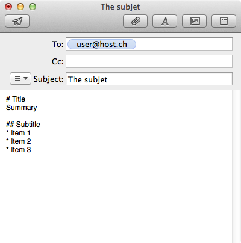
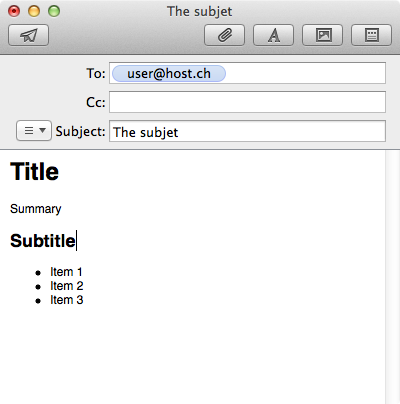

MarkdownService
===============

The MarkdownService allows to convert a Markdown text into an HTML Github Markdown using the OS X services context menu.
The main idea is to have a kind of extension of [Markdown Here](http://markdown-here.com/) for Apple Mail.

## Usage

Start by writing your text in `Markdown`.

> 

Select the text that needs to be converted, right click and finally select `Services -> Markdown to GitHub HTML`.

> 

## Install

* Compile the `MarkdownService.service` target using XCode.
* Copy `MarkdownService.service` inside the `~/Library/Services` directory.

## Improvements

* Using Github Flavored Markdown

## References

* [Markdown | GitHub API](https://developer.github.com/v3/markdown/)

## License

The MIT License (MIT)

Copyright (c) 2014 Thomas Denoréaz

Permission is hereby granted, free of charge, to any person obtaining a copy of
this software and associated documentation files (the "Software"), to deal in
the Software without restriction, including without limitation the rights to
use, copy, modify, merge, publish, distribute, sublicense, and/or sell copies of
the Software, and to permit persons to whom the Software is furnished to do so,
subject to the following conditions:

The above copyright notice and this permission notice shall be included in all
copies or substantial portions of the Software.

THE SOFTWARE IS PROVIDED "AS IS", WITHOUT WARRANTY OF ANY KIND, EXPRESS OR
IMPLIED, INCLUDING BUT NOT LIMITED TO THE WARRANTIES OF MERCHANTABILITY, FITNESS
FOR A PARTICULAR PURPOSE AND NONINFRINGEMENT. IN NO EVENT SHALL THE AUTHORS OR
COPYRIGHT HOLDERS BE LIABLE FOR ANY CLAIM, DAMAGES OR OTHER LIABILITY, WHETHER
IN AN ACTION OF CONTRACT, TORT OR OTHERWISE, ARISING FROM, OUT OF OR IN
CONNECTION WITH THE SOFTWARE OR THE USE OR OTHER DEALINGS IN THE SOFTWARE.